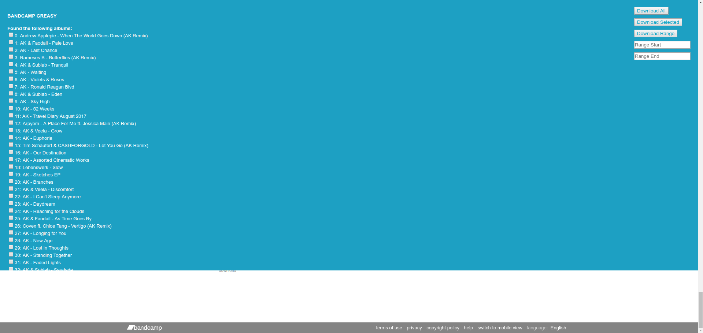

# Bandcamp Greasy
A set of [Grease Monkey](https://addons.mozilla.org/en-US/firefox/addon/greasemonkey/)/[Tamper Monkey](https://chrome.google.com/webstore/detail/tampermonkey/dhdgffkkebhmkfjojejmpbldmpobfkfo) scripts which allow you to download your entire bandcamp collection.

## Usage
1. Import [DownloadCollection](https://github.com/RyanBluth/Bandcamp-Greasy/raw/master/DownloadCollection.user.js) and [DownloadAlbum](https://github.com/RyanBluth/Bandcamp-Greasy/raw/master/DownloadAlbum.user.js) into Grease Monkey or Tamper Monkey by simply clicking the links (which should bring up the install dialog)
2. Change the value of YOUR_USERNAME to your actual username in DownloadCollection.user.js
3. Change the value of format to your desired format (MP3 320 is the default) in DownloadAlbum.user.js
  - Available formats are as follows...
    - MP3 320 (Default)
    - MP3 V0
    - FLAC
    - AAC
    - Ogg Vorbis
    - ALAC
    - WAV
    - AIFF
4. Make sure Grease Monkey/Tamper Monkey is enabled.
5. Navigate to your collection on Bandcamp and a crusty looking UI will show up to let you download you collection (you can close it anytime via right-clicking):

